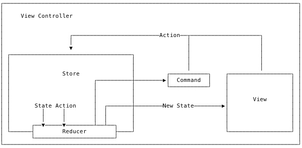

# MVC
苹果关于 MVC 的介绍 :
[The Role of View Controllers](https://developer.apple.com/library/archive/featuredarticles/ViewControllerPGforiPhoneOS/)

## 如何使 UIViewController 更整洁

[ObjC 中国 - 更轻量的 View Controllers](https://objccn.io/issue-1-1/)

[ObjC 中国 - 整洁的 Table View 代码](https://objccn.io/issue-1-2/)

## 如何写出更好的 MVC

[A Better MVC, Part 1: The Problems](https://davedelong.com/blog/2017/11/06/a-better-mvc-part-1-the-problems/)

问题：

1. 违反封装，充斥着大量面条代码
2. Massview View Controller

解决办法：
开发者为了解决上面两个问题通常会使用其它架构方式。但是会增加团队成员的学习成本。系统更新时也有可能需要更多时间来进行适配，同样地，如果你依赖了其它第三库，还需要等得第三库的更新。

[A Better MVC, Part 2: Fixing Encapsulation](https://davedelong.com/blog/2017/11/06/a-better-mvc-part-2-fixing-encapsulation/)

对 View Controller 进行解耦，View Controller 不需要知道其它 View Controller ，做法是生成一个更高层 View Controller，这个 View Controller 不包含其它逻辑，只负责对 View Controller 的跳转进行处理。所有子 View Controller 都通过它来进行跳转。

[A Better MVC, Part 3: Fixing Massive View Controller](https://davedelong.com/blog/2017/11/06/a-better-mvc-part-3-fixing-massive-view-controller/)

1 View Controller ≠ 1 screen of content

开始写 app 时，我们都会使用一个 View Controller 来表示一个屏幕的内容，但是当 app 变得复杂时，我们可以将某些比较复杂的界面分成多个小的 View Controller。

[A Better MVC, Part 4: Future Directions](https://davedelong.com/blog/2017/11/06/a-better-mvc-part-4-future-directions/)

承接上面所说的 1 View Controller ≠ 1 screen of content，单个 cell 也可以使用单个 ViewController 来管理，将 cell 中的逻辑分离出来。
总结：

- 使用 View Controllers 来分解 UI
- 使用 View Controllers 来管理列表控件
- View Controllers 不一定要填充屏幕

[A Better MVC, Part 5: An Evolution](https://davedelong.com/blog/2018/04/24/a-better-mvc-part-5-an-evolution/)

作者在五个月后又写了一篇关于 MVC 的文章。

MVC 不是一种设计模式，是一种思想，它追求封装，将不同的东西分隔开来。
View Controller 其实不是 Controller，而是 View，它负责的其实是 View 相关的逻辑。
View Controller 应该只负责处理业务逻辑或者传递数据给它包含的 UIViews，不应该两者都包含。
UIViewControllers 应该只负责下面的其中一个部分：

1. 组合 Child View Controller
2. 给自己拥有的 UIViews 填充数据

> So instead of saying a UIViewController should “manage either sequence or UI”, perhaps a better way of saying it would be that a UIViewController should either compose children or put stuff in to UIViews (with the understanding that this is a guideline, and not a rule).

## 关于 MVC 的一个常见的误用

[关于 MVC 的一个常见的误用](https://onevcat.com/2018/05/mvc-wrong-use/)

传统 MVC 由于自由度非常大，没有规则显示，在经过业务迭代后，稍不注意 ViewController 就会膨胀为 Massive View Controller ，一些潜在问题：

1. 包含 Model 层；
2. 违反数据流动规则和单一职责。


作者通过将 Model 层抽出和借助 KVO 简单录了一个单向流的 MVC ，意在说明即使没有借用其他结构（比如说 MVVM 和 RxSwift ），也可以写出一个符合规范和易维护的 ViewController 。

## 单向流数据流动

[单向数据流动的函数式 View Controller](https://onevcat.com/2017/07/state-based-viewcontroller/)

传统 MVC 的问题：

1. 修改 UI 的代码到处散落，随着逻辑变得复杂， UI 的状态将难以追踪；
2. 难以测试；
3. 无法重构。

结合纯函数将其重构为单向流：

```swift
func reducer(state: State, userAction: Action) -> State
```

输出结果 `State` 只受输入 `state` 和 `userAction` 影响，在两者相同的情况下，输出 `state` 永远相同，其原理与 Swift 中的 `reduce` 函数类似：

```swift
func reduce<Result>(_ initialResult: Result, 
                    _ nextPartialResult: (Result, Element) throws -> Result) rethrows -> Result
```

在实际使用中，仅仅靠纯函数可能无法满足我们的需求，有时候还希望有“副作用”选项，希望在完成异步操作后可以执行对应的 `command` ：

```swift
func reducer(state: State, userAction: Action) -> (State, Command?)
```

整体的架构图



使用一个 `Store` 来存储 `subscriber` 和相关数据：

```swift
protocol ActionType {}
protocol StateType {}
protocol CommandType {}

class Store<A: ActionType, S: StateType, C: CommandType> {
    let reducer: (_ state: S, _ action: A) -> (S, C?)
    var subscriber: ((_ state: S, _ previousState: S, _ command: C?) -> Void)?
    var state: S
    
    init(reducer: @escaping (S, A) -> (S, C?), initialState: S) {
        self.reducer = reducer
        self.state = initialState
    }
    
    func subscribe(_ handler: @escaping (S, S, C?) -> Void) {
        self.subscriber = handler
    }
    
    func unsubscribe() {
        self.subscriber = nil
    }
    
    func dispatch(_ action: A) {
        let previousState = state
        let (nextState, command) = reducer(state, action)
        state = nextState
        subscriber?(state, previousState, command)
    }
}
```

ViewController 通过 `subscribe` 方法来订阅数据源的改动进行 UI 调整， 通过 `dispatch` 传递 `action` 。同时也编写了一些单元测试来证明其可测试性。

这里在没有接入三方库的情况实现了单向数据流，如果想要尝试，也可试一下 

[ReSwift/ReSwift](https://github.com/ReSwift/ReSwift)

Objective-C 版本在这里：

[Objective-C单向数据流方案](https://wereadteam.github.io/2017/09/30/reflow/)

提供了一个 `RFStore` 的 `Store` 基类，内部做了一些 `hook` 处理，对于 `action` 开头的 `selector` 调用，都会调用 `listeners`  的 `block` ：

```objectivec
+ (void)hookActionMethodsIfNeededForClass:(Class)class {
    static const void * const kHasHookedKey = &kHasHookedKey;
    @synchronized(class) {
        id hasHooked = objc_getAssociatedObject(class, kHasHookedKey);
        if (!hasHooked) {
            unsigned int outCount = 0;
            Method *methods = class_copyMethodList(class, &outCount);
            for (unsigned int i = 0; i < outCount; ++i) {
                Method method = methods[i];
                SEL selector = method_getName(method);
                NSString *methodName = NSStringFromSelector(selector);
                if (![methodName hasPrefix:@"action"]) {
                    continue;
                }
                
                [RFStore registerActionForClass:class selector:selector];
            }
            objc_setAssociatedObject(class, kHasHookedKey, @YES, OBJC_ASSOCIATION_RETAIN_NONATOMIC);
        }
    }
}

+ (void)registerActionForClass:(Class)class selector:(SEL)selector {
    [class rfaspect_hookSelector:selector
                     withOptions:AspectPositionAfter
                      usingBlock:^(id<RFAspectInfo> aspectInfo) {
                          RFAction *action = [[RFAction alloc] initWithObject:aspectInfo.instance
                                                                     selector:selector
                                                                    arguments:aspectInfo.arguments];
                          
                          NSArray *globalListeners = [objc_getAssociatedObject([RFStore class], kListernersKey) allObjects];
                          NSArray *listeners = [objc_getAssociatedObject(action.object, kListernersKey) allObjects];
                          dispatch_async(dispatch_get_main_queue(), ^{
                              for (RFSubscription *subscription in globalListeners) {
                                  subscription.block(action);
                              }
                              for (RFSubscription *subscription in listeners) {
                                  subscription.block(action);
                              }
                          });
                      }
                           error:nil];
}
```

`listeners` 使用 `weak` 的 `NSPointerArray` 进行存储，所以当 ViewController 释放后， `RFStore` 也会释放掉：

```objectivec
+ (void)associateObject:(id)object withSubscription:(RFSubscription *)subscription {
    @synchronized(object) {
        NSPointerArray *listeners = objc_getAssociatedObject(object, kListernersKey);
        if (!listeners) {
            listeners = [NSPointerArray weakObjectsPointerArray];
            objc_setAssociatedObject(object, kListernersKey, listeners, OBJC_ASSOCIATION_RETAIN_NONATOMIC);
        }
        [listeners compact];
        [listeners addPointer:(void *)subscription];
    }
}
```

作者在最后提到对于 Reflow ，更重要的是其架构设计和规范：

- model 对象不可变；
- 整个 app 的数据存于 store 层；
- 更新和通知也收拢于 store 层。