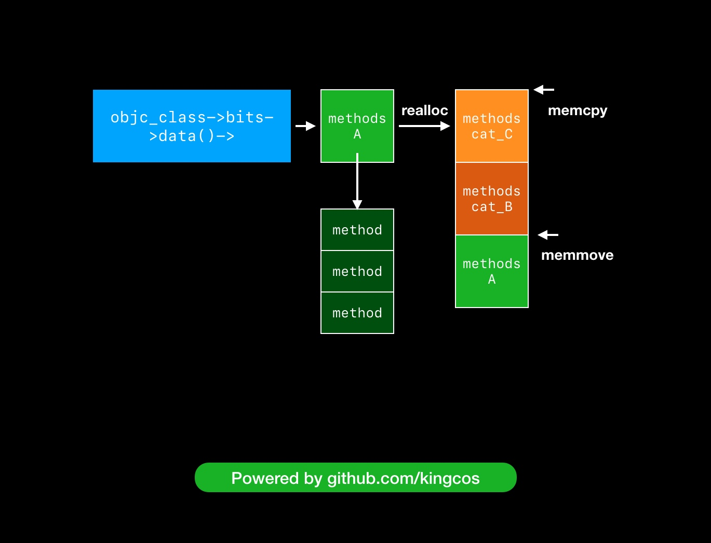

# Category

官方文档：

[Category](https://developer.apple.com/library/archive/documentation/General/Conceptual/DevPedia-CocoaCore/Category.html)

[Objective-C Category](https://zhuanlan.zhihu.com/p/24925196)

Category 的作用：

1. 为已存在的类添加方法；
2. 将类的实现分开在不同的代码文件里，减少单个代码文件的行数，将不同的功能组织到不同的 Category ，可以由多个开发者共同开发同一个类，按需加载对应的 Category ；
3. 声明私有方法，借此将私有方法公开，方便调用；
4. 模拟多继承；
5. Method Swizzling ；
6. 结合 Associated Objects 和 Category 给已有的类新增 Property ；
7. 覆盖主类的实现（也可以说是副作用）。

[深入理解Objective-C：Category](https://tech.meituan.com/2015/03/03/diveintocategory.html)

深入解析 Category ：

1. Category 和 Extension 的不同；
2. 源码解析，Category 生成的 `sturct` ；
3. Category 的属性，方法等是如何在通过 runtime 追加到主类中；
4. Category 的加载顺序；
5. Category 与 Associated Objects 。

如何调用被覆盖掉的主类方法：

```objectivec
Class currentClass = [MyClass class];
MyClass *my = [[MyClass alloc] init];

if (currentClass) {
    unsigned int methodCount;
    Method *methodList = class_copyMethodList(currentClass, &methodCount);
    IMP lastImp = NULL;
    SEL lastSel = NULL;
    for (NSInteger i = 0; i < methodCount; i++) {
        Method method = methodList[i];
        NSString *methodName = [NSString stringWithCString:sel_getName(method_getName(method)) 
        								encoding:NSUTF8StringEncoding];
        if ([@"printName" isEqualToString:methodName]) {
            lastImp = method_getImplementation(method);
            lastSel = method_getName(method);
        }
    }
    typedef void (*fn)(id,SEL);
    
    if (lastImp != NULL) {
        fn f = (fn)lastImp;
        f(my,lastSel);
    }
    free(methodList);
}
```

这里是顺序遍历，可以使用逆序遍历，找到第一个 IMP 就返回，会快那么一点点。

[iOS 中的 Category](https://kingcos.me/posts/2019/category_in_ios/)

这篇文章非常详细，从 `realloc` 到 `memmove` 和 `memcpy` 都有讲：



[Category 特性在 iOS 组件化中的应用与管控](https://tech.meituan.com/2018/11/08/ios-category-module-communicate.html)