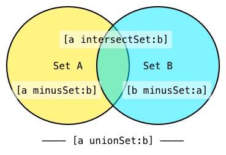

# 集合类型
## NSArray/NSMutableArray

通过一个可能为 nil 的数组创建一个可变数组，可以这么写:
```objc
NSMutableArray *mutableObjects = [array mutableCopy];
if (!mutableObjects) {
    mutableObjects = [NSMutableArray array];
}
```
三元运算符:
```objc
NSMutableArray *mutableObjects = [array mutableCopy] ?: [NSMutableArray array];
```
更好的解决方案是使用 `arrayWithArray:` ，即使原数组为 `nil` ，该方法也会返回一个数组对象:
```objc
NSMutableArray *mutableObjects = [NSMutableArray arrayWithArray:array];
```

在数组的开头和结尾插入/删除元素通常是一个 O(1)操作，而随机的插入/删除通常是 O(N) 的。
`NSArray` 的大多数方法使用 `isEqual:` 来检查对象间的关系，如 `containsObject:` 。如果确定 `NSArray` 中包含你所搜索的对象，使用 `indexOfObjectIdenticalTo:` 可以加快搜索速度。

不要使用 `[@[] mutableCopy]` ，虽然可能会快一点点，使用 `[NSMutableArray array]` 可读性更好。

这里有一篇 `NSArray` 文章写的不错：
[关于NSArray的二三事](https://juejin.im/post/5b07837df265da0de1011652)

## NSPointerArray
[NSPointerArray](https://developer.apple.com/documentation/foundation/nspointerarray)

- 行为与 `NSArray` 类似，但是可以存储 `NULL` 值
- `NULL` 值会影响 `count` 
- 可以通过设置 `count` 来插入 `NULL` ;
- 支持 weak ；
- `allObjects` 可以转换成 `NSArray` ，所有的 `NULL` 值都会被去掉，如果 `NSPointerArray` 插入了非对象指针， `allObjects` 会报 `EXC_BAD_ACCESS` 崩溃；
- `compact` 可以去掉数组中的 `NULL` ，调用前需要通过 `addPointer:` 方法添加一次 `NULL` ，否则不起作用

```objc
NSPointerArray *array = [NSPointerArray strongObjectsPointerArray];
array.count = 10;
[array insertPointer:@"Pointer1" atIndex:0];
for (id object in array) {
    NSLog(@"%@", object); // 输出结果为 1 个 NSString 和 11 个 NULL
}
NSLog(@"%lu", (unsigned long)array.count); // 11
NSLog(@"%@", array.allObjects); 
[array addPointer:NULL]; // 注释掉这行下面的 count 还是 11
[array compact];
NSLog(@"%lu", (unsigned long)array.count);
/* 
(
    Pointer1
)
*/
```

## NSSet/NSMutableSet
`allObjects` 方法返回 `NSArray` 。
`NSMutableSet` 有几个很强大的方法，例如 `intersectSet:` ， `minusSet:` 和` unionSet:` 。

