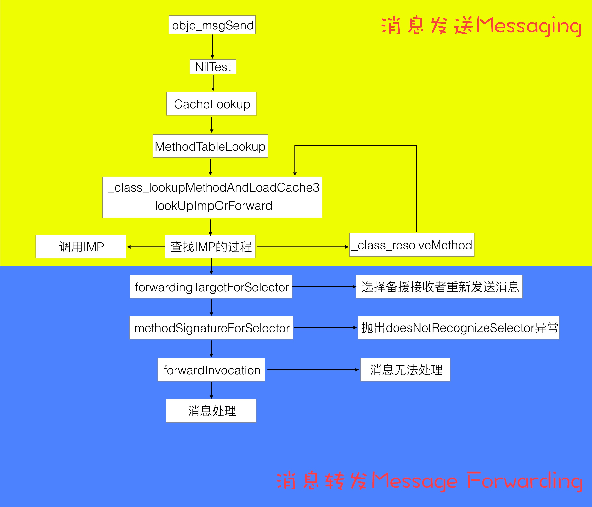

# Message Sending & Forwarding
[神经病院 Objective-C Runtime 住院第二天--消息发送与转发](https://halfrost.com/objc_runtime_objc_msgsend/)

作者画了一张非常清晰的流程图，可以先看图再看文章。



[Objective-C 消息发送与转发机制原理](http://yulingtianxia.com/blog/2016/06/15/Objective-C-Message-Sending-and-Forwarding/)

这里有说到为什么 `objc_msgSend` 要使用汇编进行处理：

其实在 [objc-msg-x86_64.s](https://github.com/opensource-apple/objc4/blob/master/runtime/Messengers.subproj/objc-msg-x86_64.s) 中包含了多个版本的 `objc_msgSend` 方法，它们是根据返回值的类型和调用者的类型分别处理的：

- `objc_msgSendSuper`:向父类发消息，返回值类型为 `id`
- `objc_msgSend_fpret`:返回值类型为 floating-point，其中包含 `objc_msgSend_fp2ret` 入口处理返回值类型为 `long double` 的情况
- `objc_msgSend_stret`:返回值为结构体
- `objc_msgSendSuper_stret`:向父类发消息，返回值类型为结构体

当需要发送消息时，编译器会生成中间代码，根据情况分别调用 `objc_msgSend`, `objc_msgSend_stret`, `objc_msgSendSuper`, 或 `objc_msgSendSuper_stret` 其中之一。

这也是为什么 `objc_msgSend` 要用汇编语言而不是 OC、C 或 C++ 语言来实现，因为单独一个方法定义满足不了多种类型返回值，有的方法返回 `id`，有的返回 `int`。考虑到不同类型参数返回值排列组合映射不同方法签名（method signature）的问题，那 switch 语句得老长了。。。**这些原因可以总结为 [Calling Convention](https://en.wikipedia.org/wiki/Calling_convention)，也就是说函数调用者与被调用者必须约定好参数与返回值在不同架构处理器上的存取规则，比如参数是以何种顺序存储在栈上，或是存储在哪些寄存器上。**除此之外还有其他原因，比如其可变参数用汇编处理起来最方便，因为找到 IMP 地址后参数都在栈上。要是用 C++ 传递可变参数那就悲剧了，prologue 机制会弄乱地址（比如 i386 上为了存储 `ebp` 向后移位 4byte），最后还要用 epilogue 打扫战场。而且汇编程序执行效率高，在 Objective-C Runtime 中调用频率较高的函数好多都用汇编写的。

还有一张巨详细的图：


## 消息发送 Sending

[draveness/analyze](https://github.com/draveness/analyze/blob/master/contents/objc/%E4%BB%8E%E6%BA%90%E4%BB%A3%E7%A0%81%E7%9C%8B%20ObjC%20%E4%B8%AD%E6%B6%88%E6%81%AF%E7%9A%84%E5%8F%91%E9%80%81.md)

通过断点方式来查看消息发送的调用顺序：

1. 缓存命中
2. 查找当前类的缓存及方法
3. 查找父类的缓存及方法
4. 方法决议
5. 消息转发

`objc_msgSend` 的调用栈：

```objectivec
0 lookUpImpOrForward
1 _class_lookupMethodAndLoadCache3
2 objc_msgSend
3 main
4 start
```

[mikeash.com: Friday Q&A 2012-11-16: Let's Build objc_msgSend](https://www.mikeash.com/pyblog/friday-qa-2012-11-16-lets-build-objc_msgsend.html)

Mike Ash 尝试自己实现了 `objc_msgSend` ，前面部分为了拦截系统 `objc_msgSend` ，使用的是汇编来实现，当在缓存找不到 IMP 时，改用可维护的 C 来实现，由于找不到缓存的概率较小，和找不到缓存后对速度要求没那么高，所以改用 C 来实现。

伪代码实现：

```objectivec
IMP class_getMethodImplementation(Class cls, SEL sel)
{
    IMP imp;
    if (!cls  ||  !sel) return nil;
    imp = lookUpImpOrNil(cls, sel, nil, YES/*initialize*/, YES/*cache*/, YES/*resolver*/);
    // Translate forwarding function to C-callable external version
    if (!imp) {
        return _objc_msgForward;
    }
    return imp;
}
```

## 消息转发 Forwarding

[mikeash.com: Friday Q&A 2009-03-27: Objective-C Message Forwarding](https://mikeash.com/pyblog/friday-qa-2009-03-27-objective-c-message-forwarding.html)

当给一个对象发送一个它无法响应的消息时，并不会说直接抛出 `unrecognized selector sent to instance` 错误，而是会经过一系列的消息转发处理，提供了处理机制。

### Lazy method resolution

runtime 在发送消息时会查找对应的 `IMP` ，而 Lazy method resolution 提供了一个延迟到发送消息时才生成对应方法的机制，而不是提前就设置好所有方法。 Lazy method solution 处理消息非常快，当添加完方法后就会走正常的消息处理流程，但是缺少灵活性，无法改变参数，接收对象和返回参数等。在 Lazy method solution 中会调用以下方法：

```objectivec
/// 类方法
+ (BOOL)resolveClassMethod:(SEL)sel;
/// 对象方法
+ (BOOL)resolveInstanceMethod:(SEL)sel;
```

如果在方法中添加 `SEL` 的实现和返回 `YES` ，就会重走消息处理流程，如果返回 `NO` 就会进入消息转发的下一个流程。

CoreData 就是通过结合 `@dynamic` 属性，在运行时动态生成 `setter` 和 `getter` 方法。

### Fast Fowarding

在 Lazy method resolution 返回 `NO` 之后，就会走到 Fast Fowarding 流程，调用以下方法：

```objectivec
- (id)forwardingTargetForSelector:(SEL)aSelector;
```

通过这个方法我们可以返回其它对象来响应这个 `SEL` ，这里属于消息转发的基础流程，所以性能开销也比较小。通过这个方法，我们可以实现类似于多继承的机制，根据不同的 `SEL` 返回不同的对象，即使自己当前没有实现对应的 `SEL` 。

### Normal Forwarding

Normal Forwarding 是消息转发的最后一个处理流程，会相继调用以下两个方法：

```objectivec
- (NSMethodSignature *)methodSignatureForSelector:(SEL)sel;
- (void)forwardInvocation:(NSInvocation *)inv;
```

先调用 `methodSignatureForSelector:` 方法来返回 `NSMethodSignature` ， `NSMethodSignature` 用于生成 `NSInvocation` ，而 `NSInvocation` 包含了 `Target` ， `SEL` ，所有参数和返回值，它以对象的形式对消息进行了一层封装。然后就会调用 `forwardInvocation:` 对 `NSInvocation` 进行处理。 `NSInvocation` 非常灵活，返回值，处理对象，参数和 `SEL` 都可以进行改变。下面是一个非常简单的例子，假设我们想给 `NSArray` 添加一个这样的特性：当给  `NSArray` 发送消息时，如果 `NSArray` 无法响应，就查找它里面的元素，找出可以响应的对象并进行发送。

```objectivec
@implementation NSArray (ForwardingIteration)

- (NSMethodSignature *)methodSignatureForSelector:(SEL)sel
{
    NSMethodSignature *sig = [super methodSignatureForSelector:sel];
    if(!sig)
    {
        for(id obj in self)
            if((sig = [obj methodSignatureForSelector:sel]))
                break;
    }
    return sig;
}

- (void)forwardInvocation:(NSInvocation *)inv
{
    for(id obj in self)
        [inv invokeWithTarget:obj];
}

@end
```

以上三个流程，性能递减，灵活性递增，可以根据具体需求在对应的流程中进行处理。

## 消息转发的应用

[Objective-C 消息转发应用场景摘录](https://triplecc.github.io/2017/07/09/2017-07-09-objective-cxiao-xi-zhuan-fa-ying-yong-zhi-ji-chu/)

### Weak Proxy

[ibireme/YYKit](https://github.com/ibireme/YYKit/blob/master/YYKit/Utility/YYWeakProxy.m)

`YYWeakProxy` 通过弱引用持有对象来避免循环引用，在设置 `NSTimer` 或者 `CADisplayLink` 时可以使用，示例代码：

```objectivec
@implementation MyView {
    NSTimer *_timer;
}

- (void)initTimer {
    YYWeakProxy *proxy = [YYWeakProxy proxyWithTarget:self];
    _timer = [NSTimer timerWithTimeInterval:0.1 target:proxy selector:@selector(tick:) userInfo:nil repeats:YES];
}

- (void)tick:(NSTimer *)timer {...}
@end
```

### Delegate Proxy

[Instagram/IGListKit](https://github.com/Instagram/IGListKit/blob/019b22da07324f5dfdb81863865360937087b95d/Source/IGListKit/Internal/IGListAdapterProxy.m)

内部对代理进行一层封装，可以区分不同的方法，转发给不同的对象，也可以减少胶水代码，不需要手动对每个代理方法进行转发。

### Multicast Delegate

[robbiehanson/XMPPFramework](https://github.com/robbiehanson/XMPPFramework/wiki/MulticastDelegate)

Wiki 里列了一下 `Delegate` 和 `Notification` 的优缺点，以及 Multicast Delegate 的特性。

`Delegate` 优点：

- 注册多个回调方法更加容易；
- 处理多个参数时更加容易和简单；
- 允许返回值。

`Delegate` 缺点：

- 只能有一个 `Delegate` 。

`Notification` 优点：

- 多个对象可以响应同一个通知。

`Notification` 缺点：

- 注册多个回调时非常麻烦；
- 从 `Dictionary` 里取出参数时也十分麻烦；
- 不支持返回值。

Multicast Delegate 支持的特性：

- 支持多个回调对象，即广播给所有监听者；
- 良好的扩展性，支持定义不同的 `Delegate` ；
- 支持返回值；
- 线程安全。

核心原理就是在 `methodSignatureForSelector:` 和 `forwardInvocation:` 中进行调用 `delegates` 中对应的方法，具体实现可以查看源代码：

[robbiehanson/XMPPFramework](https://github.com/robbiehanson/XMPPFramework/blob/master/Utilities/GCDMulticastDelegate.m)

### NSUndoManager

`NSUndoManager` 通过 `NSInvocation` 记录 `undo` 时需要执行的方法，当 `undo` 时就触发最新的 `NSInvocation` 。

### Aspects

[steipete/Aspects](https://github.com/steipete/Aspects)

核心原理：

1. 对 `-forwardInvocation:` 进行 hook ，以便在执行原函数前后进行一些操作；
2. 对需要处理的方法进行 hook ，替换为 `_objc_msgForward` 或者 `_objc_msgForward_stret` ，这样就会触发消息转发机制，执行 `-forwardInvocation:` 。

具体的源码解析：

[Aspects](https://dirtmelon.github.io/posts/Aspects/)