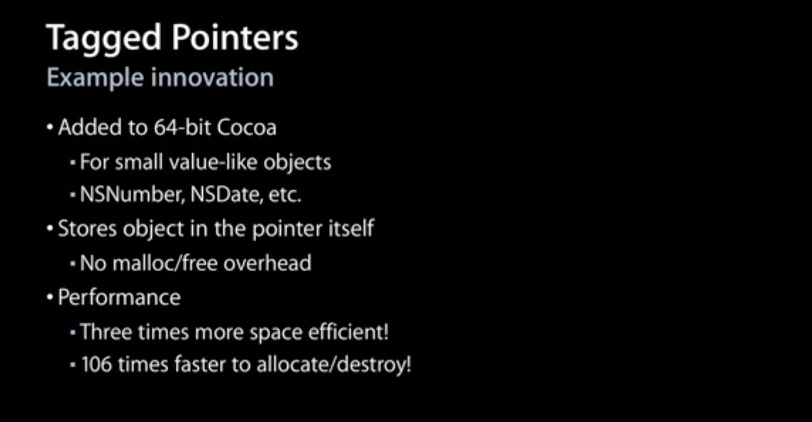
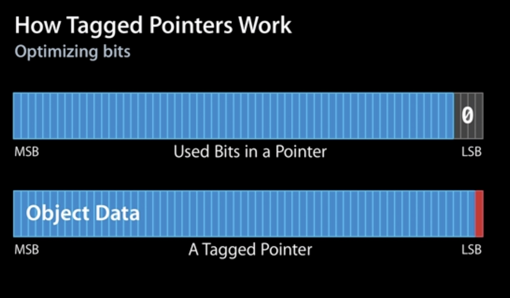

# Tagged Pointer
[Tagged pointer](https://en.wikipedia.org/wiki/Tagged_pointer)

对象存储在内存中的时候总是内存对齐的，所以它们的地址会是单个指针大小的倍数，通常来说会是 16 的倍数。在 64 位系统中，对象的指针为 64 位整形。后面几位为 0 。由于后面几位一直为 0 。所以我们可以使用后面几位来记录一些事情。

[Advances in Objective-C - WWDC 2013 - Videos - Apple Developer](https://developer.apple.com/videos/play/wwdc2013/404/)

WWDC 2013 上相关介绍，从 36:49 开始。



苹果使用 Tagged Pointer 来存储一些比较小的数据，如： `NSNumber` ， `NSDate` 和 `NSString` 等；

由于直接使用指针本身来存储数据，不再需要额外生命周期管理，没有 `malloc/free` ；

3 倍的空间优化， 106 倍的创建或者销毁速度



使用低位的 `bit` 来作为标识位。

[内存管理（二）Tagged Pointer](https://wenghengcong.com/posts/b6becb26/)

[https://juejin.im/post/6844904132940136462](https://juejin.im/post/6844904132940136462)

由于内存对齐的关系，指针的值最后四位都是 0 ，所以可以使用这四位来做一些记录。如果最后一位是 1 ，则这个指针是 Tagged Pointer 。

```objectivec
static inline bool 
_objc_isTaggedPointer(const void *ptr) 
{
    return ((intptr_t)ptr & _OBJC_TAG_MASK) == _OBJC_TAG_MASK;
}

#if OBJC_MSB_TAGGED_POINTERS
#   define _OBJC_TAG_MASK (1ULL<<63)
#else
#   define _OBJC_TAG_MASK 1
#endif

#if TARGET_OS_OSX && __x86_64__
    // 64-bit Mac - tag bit is LSB
#   define OBJC_MSB_TAGGED_POINTERS 0
#else
    // Everything else - tag bit is MSB
#   define OBJC_MSB_TAGGED_POINTERS 1
#endif
```

在 iOS 平台上使用的是最高位进行判断，在 macOS 上 使用的是最低位。 Tagged Pointer 支持的类型：

```objectivec
enum
{
    OBJC_TAG_NSAtom            = 0, 
    OBJC_TAG_1                 = 1, 
    OBJC_TAG_NSString          = 2, 
    OBJC_TAG_NSNumber          = 3, 
    OBJC_TAG_NSIndexPath       = 4, 
    OBJC_TAG_NSManagedObjectID = 5, 
    OBJC_TAG_NSDate            = 6, 
    OBJC_TAG_RESERVED_7        = 7, 

    OBJC_TAG_First60BitPayload = 0, 
    OBJC_TAG_Last60BitPayload  = 6, 
    OBJC_TAG_First52BitPayload = 8, 
    OBJC_TAG_Last52BitPayload  = 263, 

    OBJC_TAG_RESERVED_264      = 264
};
```

Tagged Pointer 不是真的对象，没有 isa 指针，不存在 `retain` ， `release` ， `autorelease` 等对象生命周期管理的流程，其引用计数为 `NSUInteger` 的最大值。

```objectivec
dispatch_queue_t queue = dispatch_queue_create("parallel", DISPATCH_QUEUE_CONCURRENT);
for (int i = 0; i < 1000; i ++) {
    dispatch_async(queue, ^{
        self.name = [NSString stringWithFormat:@"abcdefghijk"];
    })
}
dispatch_queue_t queue = dispatch_queue_create("parallel", DISPATCH_QUEUE_CONCURRENT);
for (int i = 0; i < 1000; i ++) {
    dispatch_async(queue, ^{
        self.name = [NSString stringWithFormat:@"abc"];
    })
}
```

上面的代码中，第一个 for 循环会崩溃，因为在多线程中可能会重复 `release` ，而第二个不会，因为 Tagged Pointer 其实是值类型，不涉及到 `retain` 和 `release` 操作，其赋值操作是原子性的。

[mikeash.com: Friday Q&A 2012-07-27: Let's Build Tagged Pointers](https://www.mikeash.com/pyblog/friday-qa-2012-07-27-lets-build-tagged-pointers.html)

Mike Ash 尝试自己实现了一个 Tagged Pointer 。

[mikeash.com: Friday Q&A 2015-07-31: Tagged Pointer Strings](https://mikeash.com/pyblog/friday-qa-2015-07-31-tagged-pointer-strings.html)

[Tagged Pointer 字符串](https://swift.gg/2018/10/08/tagged-pointer-strings/)

如果某些字符串可以保存为 60 位以内的二进制数据，那么对应的 `NSString` 就会被创建为 Tagged Pointer 。

由于 `NSString` 字符串编码的特殊性，苹果针对 `NSString` 的 Tagged Pointer 进行优化。

### 实现

```objectivec
NSString *a = @"a";
NSString *b = [[a mutableCopy] copy];
NSLog(@"%p %p %@", a, b, object_getClass(b));
```

1. 常量字符串不会被存储为 Tagged Pointer ，因为常量字符串必须保证可以兼容不同的系统，但是 Tagged Pointer 的内部实现细节却不能保证兼容不同的系统，常量字符串嵌入到二进制字符串时有可能会崩溃；
2. 先执行 `[a mutableCopy]` ，因 `copy` 返回的是不可变的字符串，所以常量字符串的 `copy` 得到的还是原来的常量字符串，所以先通过 `mutableCopy` 生成一个新的可变字符串，然后再通过 `copy` 得到一个不可变的 Tagged Pointer ， Tagged Pointer 只会在运行时创建。

输出结果如下：

```objectivec
0x10ba41038 0x6115 NSTaggedPointerString
```

首先第一个 `a` 不是 Tagged Pointer ，是一个对象的指针，第二个是 Tagged Pointer。

然后 `NSString` 对应的 Tagged Pointer 使用的是 ASCII 编码，占用的长度较少。

伪代码：

```objectivec
unsigned short -[NSTaggedPointerString characterAtIndex:](void * self, void * _cmd, unsigned long long index) {
     int8_t buffer[11];
     length = self >> 0x4 & 0xf;
     if (length >= 0x8) {
             stringData = self >> 0x8;
             table = "eilotrm.apdnsIc ufkMShjTRxgC4013bDNvwyUL2O856P-B79AFKEWV_zGJ/HYX";
             cursor = length;
             if (length < 0xa) {
                     do {
                             buffer[cursor - 1] = table[stringData & 0x3f];
                             cursor = cursor - 0x1;
                             stringData = stringData >> 0x6;
                     } while (cursor != 0x0);
             }
             else {
                     do {
                             buffer[cursor - 1] = table[stringData & 0x1f];
                             cursor = cursor - 0x1;
                             stringData = stringData >> 0x5;
                     } while (cursor != 0x0);
             }
     } else {
         *(uint64_t *)buffer = self >> 8;
     }
     if (length <= index) {
             rbx = r8;
             ___CFExceptionProem(self, _cmd);
             [NSException raise:@"NSRangeException" format:@"%@: Index %lu out of bounds; string length %lu"];
             r8 = rbx;
     }
     rax = buffer[index];
     return rax;
 }
```

1. 长度小于 8 的情况下，直接使用 ASCII 编码，所以 `self` 按位编译后直接赋值给 `buff` 即可；
2. 长度大于等于8小于10，就会取出 `stringData` 的最低 6 位，作为 `table` 的索引取出相应的值拷贝到 `buffer` 中，然后将 `stringData` 右移 6 位，重复操作；
3. 如果大于等于 10 ，那么就会使用 5 位编码，而 `table` 只使用前半部分；

构造 `NSString` Tagged Pointer 的原理大致上也和上面的一致。

6 位编码表：

```
eilotrm.apdnsIc ufkMShjTRxgC4013bDNvwyUL2O856P-B79AFKEWV_zGJ/HYX
```

 猜测是按照在英语中出现的频率进行排序，使得尽量多的字符串可以使用 Tagged Pointer 。通过一个简单又巧妙的查找表方式在有限的空间内存储尽量的数据。