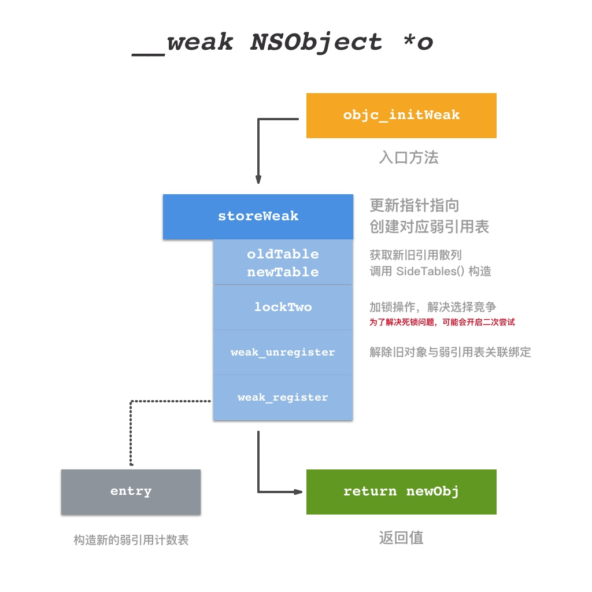
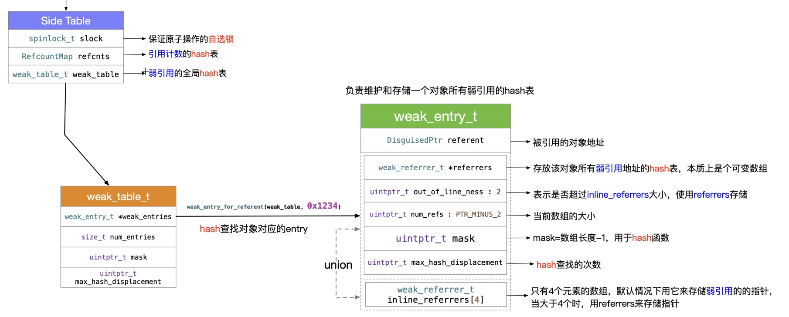
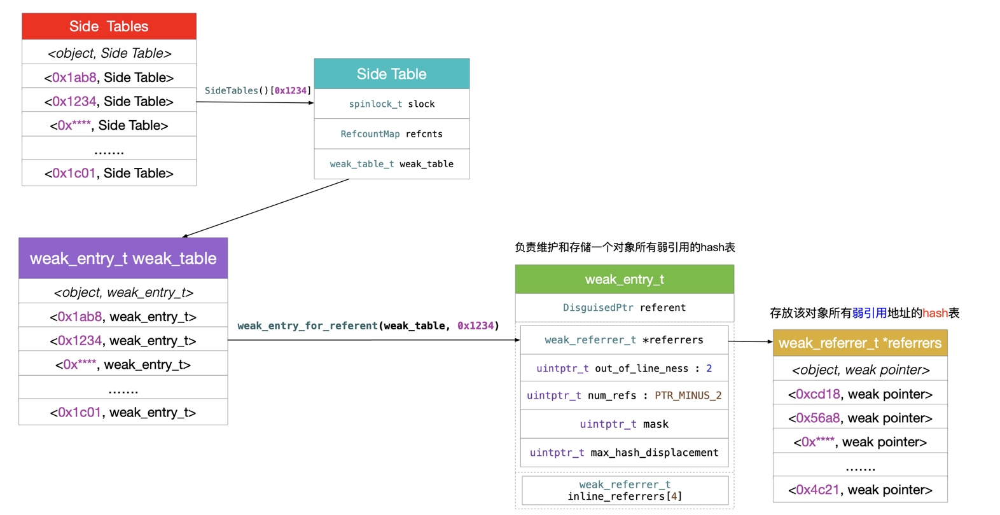

# Weak 
## 实现

[Objective-C weak 弱引用实现](https://triplecc.github.io/2019/03/20/objective-c-weak-implement/)

作者在文中提供了一个简单版的 `weak` 实现：

```objc
// { 对象地址 : [ 对象指针地址1、 对象指针地址1] }
static NSMutableDictionary *weakTable;
@interface A : NSObject
@end
@implementation A
- (void)dealloc {
    // 获取指向此对象的所有指针变量地址
    for (NSNumber *ptrPtrNumber in weakTable[@((uintptr_t)self)]) {
        // 根据指针变量地址，将指针变量置为 nil
        // 这里就是 w1 置 nil
        uintptr_t **ptrPtr = (uintptr_t **)[ptrPtrNumber unsignedLongValue];
        *ptrPtr = nil;
    }
    // 移除和此对象相关的数据
    [weakTable removeObjectForKey:@((uintptr_t)self)];
}
@end
int main(int argc, const char * argv[]) {
    @autoreleasepool {
        weakTable = @{}.mutableCopy;
        __unsafe_unretained NSObject *w1;
        @autoreleasepool {
            NSObject *obj = [A new];
            uintptr_t objAddr = (uintptr_t)obj;

            w1 = obj;
            // 将对象地址和需要自动置 nil 的指针变量的地址保存至 map 中
            // 使用可变数组方便处理多个需要置 nil 的变量指向 obj
            weakTable[@(objAddr)] = @[@((uintptr_t)&w1)].mutableCopy;
            // 即将走出 w1 所在作用域，将 w1 的地址从 map 中清除
            [weakTable[@((uintptr_t)w1)] removeObject:@((uintptr_t)&w1)];
        }
        NSLog(@"%@", w1);
    }
    return 0;
}
```

系统的 `weak` 实现总结如下：

> 设置 `__weak` 修饰的变量时， `runtime` 会生成对应的 `entry` 结构放入 `weak hash table` 中，以赋值对象地址生成的 `hash` 值为 `key` ，以包装 `__weak` 修饰的指针变量地址的 `entry` 为 `value` ，当赋值对象释放时， `runtime` 会在目标对象的 `dealloc` 处理过程中，以对象地址（ `self` ）为 `key` 去 `weak hash table` 查找 `entry` ，置空 `entry` 指向的的所有对象指针。
> 实际上 `entry` 使用数组保存指针变量地址，当地址数量不大于 4 时，这个数组就是个普通的内置数组，在地址数量大于 4 时，这个数组就会扩充成一个 `hash table` 。
> 系统会提供一个 `SideTable` 来关联对象引用和弱引用表，对于一个对象来说这个结构实例是唯一的。一般来说，objc 2.0 的对象引用计数都会优先保存在 `isa` 的 `extra_rc` 位段中，只有超出了存储的限制才会将超出部分保存到对应的 `SideTable` 中， `isa` 使用 `has_sidetable_rc` 标记是否超出限制。
> 系统的实现需要针对 `TaggedPointer` 进行特殊处理。
> `weak_entry_t` 使用 `union` 来进行记录，在 `weak` 指针数量小于 4 个时可以快速访问。

文章不算很长，但是把创建和销毁流程讲得非常清晰。主要重点在 `weak_entry_t` 的处理， `hash` 的计算。

[weak 弱引用的实现方式](https://www.desgard.com/objective-c/2016/09/10/weak.html)

整体流程说得比较清晰，代码注释和解释也比较详细


[内存管理（四）引用计数与 weak](https://wenghengcong.com/posts/7162dd05/)

这篇文章中提供了两张非常好的流程图：




## 应用

[iOS weak 关键字漫谈](https://zhuanlan.zhihu.com/p/27832890)

`weak singleton` ，当所有持有单例的对象都释放后，单例也会被释放掉，减少内存浪费。

```objc
+ (id)sharedInstance
{
    static __weak ASingletonClass *instance;
    ASingletonClass *strongInstance = instance;
    @synchronized(self) {
        if (strongInstance == nil) {
            strongInstance = [[[self class] alloc] init];
            instance = strongInstance;
        }
    }
    return strongInstance;
}
```

`weak associated object` ，`associated object` 本身并不支持添加具备 `weak` 特性的 `property` ，但我们可以通过一个小技巧来完成：

```objc
- (void)setContext:(CDDContext*)object {
    id __weak weakObject = object;
    id (^block)() = ^{ return weakObject; };
    objc_setAssociatedObject(self, @selector(context), block, OBJC_ASSOCIATION_COPY);
}

- (CDDContext*)context {
    id (^block)() = objc_getAssociatedObject(self, @selector(context));
    id curContext = (block ? block() : nil);
    return curContext;
}
```

文章最后一段话写得很好：
> 编程语言一直处于进化当中，语言的设计者会站在宏观的角度，结合行业的需要，添加更多的方便特性，如果只是记住官方文档里的几个应用场景，而不去思考背后的设计思路，则很难写出有想象力的代码。

[如何实现ARC中weak功能？](http://samwei12.com/2016/03/09/Objective-C/%E5%A6%82%E4%BD%95%E6%A8%A1%E6%8B%9Fruntime%E4%B8%ADweak%E7%9A%84%E5%AE%9E%E7%8E%B0%EF%BC%9F/)

weak 的简易版实现。借用 block 和 unsafe_unretained 实现 weak ，在对象 dealloc 时调用 block ，而 block 会将 unsafe_unretained 指针指向 nil 。