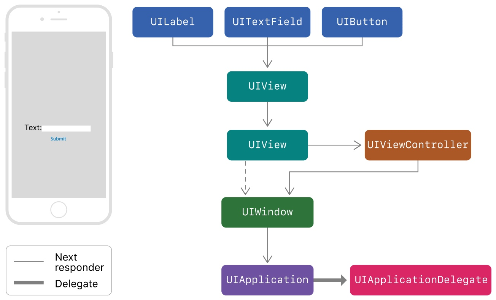

# 点击事件与响应链
[Using Responders and the Responder Chain to Handle Events](https://developer.apple.com/documentation/uikit/touches_presses_and_gestures/using_responders_and_the_responder_chain_to_handle_events)
官方文档依旧是最好的入门材料。




很多 `UIKit` 的类都重写了 `UIResponder` 的 `next` 属性来为我们返回下一个 `Responder` 对象：

- `UIView` ，如果它是 `viewController` 的 `root view` ，那么 `next` 就会返回这个 `viewController` ，否则就会返回 `superview` ；
- `UIViewController`
    - 如果 `viewController` 的 `view` 是 `window` 的 `root view`  ，那么 `next` 就返回 `window`  ；
    - 如果 `viewController` 由其它 `viewController` 弹出，那么 `next` 就返回其它 `viewController` ；
- `UIWindow` ， `next` 返回 `UIApplication` ；
- `UIApplication` ， `next` 返回 `app delegate` , 但是只有在 `app delegate` 是 `UIResponder` 时才会这样，它不能是 `view` 或者 `viewController` ；

其它一些写得不错的文章：
[深入理解 iOS 事件机制](https://juejin.im/post/5d396ef7518825453b605afa#heading-23)

[iOS触摸事件全家桶](https://juejin.im/entry/6844903493640290311)

`UIGestureRecognizer` ， `UIControl` 与响应链的关系。

## 应用

### 扩大子视图的点击范围

[谈谈响应链](https://juejin.im/post/5b83dcf9518825278e2729c5)

本文先是介绍了响应链的基本原理，然后讲述了如何响应在父视图外的子视图点击事件。

### 全局监听用户的点击事件

之前做过一个需求是用户在一定时间内没有点击屏幕就进行一些处理，我们可以对响应事件的顶层 `UIApplication` 进行操作，`hook` 它的 `sendEvent:` 事件，在用户停止点击时开始计时，记录用户没有点击的时间，进行一些操作。有几个需要注意的地方：

1. `sendEvent` 不仅仅是处理点击事件，所以需要判断下  `allTouches.count` 是否为 0 ，如果为 0 则表示不是点击事件；
2.  如果 `touch.phase == UITouchPhaseBegan` 表示用户点击屏幕，停止计时；
3. 如果 `phase == UITouchPhaseEnded` ，则表示有手指离开屏幕，因为有可能是多指同时点击，所以这里记录下 `countOfEnded` ，如果 `touches.count == countOfEnded` ，表示所有手指都离开屏幕，可以开始计时；

```objectivec
- (void)dt_sendEvent:(UIEvent *)event
{
    [self dt_sendEvent:event];

    if (event.allTouches.count == 0) {
        return;
    }
    NSArray <UITouch *> *touches = [event.allTouches allObjects];
    NSUInteger countOfEnded = 0;
    for (UITouch *touch in touches) {
        UITouchPhase phase = touch.phase;
        if (phase == UITouchPhaseBegan) {
            // 开始点击，停止计时
            // stopTimer 
						return;
        } else if (phase == UITouchPhaseEnded) {
            countOfEnded += 1;
        }
    }
    // 所有点击事件都结束，开始计时
    if (touches.count == countOfEnded) {
        // startTimer
    }
}
```

### 巧用 `UIApplication` 的 `sendAction`

[iOS Responder Chain: UIResponder, UIEvent, UIControl and uses](https://swiftrocks.com/understanding-the-ios-responder-chain.html)

这篇文章虽然也是讲了下 `UIResponder` ， `UIEvent` 和 `UIControl` ，但是后面有几个非常有趣的用法。

```swift
final class BlinkableView: UIView {
    override var canBecomeFirstResponder: Bool {
        return true
    }

    func select() {
        becomeFirstResponder()
    }

    @objc func performBlinkAction() {
        //Blinking animation
    }
}

UIApplication.shared.sendAction(#selector(BlinkableView.performBlinkAction), to: nil, from: nil, for: nil)
//Will precisely blink the last BlinkableView that had select() called.
```

`BlinkableView` 的 `canBecomeFirstResponder` 返回 `true` ，调用 `select` 时 `becomeFirstResponder()` 。然后说下具体用法，比如说现在我们想让当前的 `BlinkableView` 执行 `performBlinkAction()` 方法，其它的 `BlinkableView` 都不执行，可以通过 `UIApplication.shared.sendAction(#selector(BlinkableView.performBlinkAction), to: nil, from: nil, for: nil)` 方法来达到目的，当响应链找到第一个 `BlinkableView` (firstResponder) 时就会停止。

```swift
final class PushScreenEvent: UIEvent {

    let viewController: CoordenableViewController

    override var type: UIEvent.EventType {
        return .touches
    }

    init(viewController: CoordenableViewController) {
        self.viewController = viewController
    }
}

final class Coordinator: UIResponder {

    weak var viewController: CoordenableViewController?

    override var next: UIResponder? {
        return viewController?.originalNextResponder
    }

    @objc func pushNewScreen(sender: Any?, event: PushScreenEvent) {
        let new = event.viewController
        viewController?.navigationController?.pushViewController(new, animated: true)
    }
}

class CoordenableViewController: UIViewController {

    override var canBecomeFirstResponder: Bool {
        return true
    }

    private(set) var coordinator: Coordinator?
    private(set) var originalNextResponder: UIResponder?

    override var next: UIResponder? {
        return coordinator ?? super.next
    }

    override func viewDidAppear(_ animated: Bool) {
        //Fill info at viewDidAppear to make sure UIKit
        //has configured this view's next responder.
        super.viewDidAppear(animated)
        guard coordinator == nil else {
            return
        }
        originalNextResponder = next
        coordinator = Coordinator()
        coordinator?.viewController = self
    }
}

final class MyViewController: CoordenableViewController {
    //...
}

//From anywhere in the app:

let newVC = NewViewController()
UIApplication.shared.push(vc: newVC)

// 原文代码漏了这段，给补上
extension UIApplication {
    func push(vc: CoordenableViewController) {
	      UIApplication.shared.sendAction(#selector(Coordinator.pushNewScreen(sender:event:)), 
																			  to: nil, 
																			  from: nil, 
																			  for: PushScreenEvent(viewController: CoordenableViewController))
	  }
}
```

调整后的响应链如下：

```swift
// MyView -> MyViewController -> Coordinator -> UIWindow -> UIApplication -> AppDelegate
```

当通过 `UIApplication` 发送 `action` 时，通过响应链查找可以找到 `Coordinator` ， `Coordinator` 通过 `PushScreenEvent` 进行 `push` 。

上面两个例子只是理论上可以这么做，原作者并没有在实际项目中尝试，这里是为了说明通过响应链做一些有趣的事情。

### 查找某个 `UIView` 所在 `viewController`

当我们需要获取某个 `UIView` 所在的 `viewController` 时，也可以通过响应链来进行处理：

```swift
extension UIView {
  var closestViewController: UIViewController? {
    if let nextResponder = self.next as? UIViewController {
      return nextResponder
    } else if let nextResponder = self.next as? UIView {
      return nextResponder.closestViewController
    } else {
      return nil
    }
  }
}
```